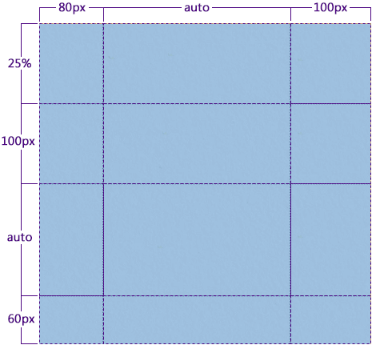
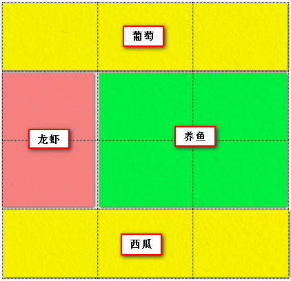

# grid布局
[[toc]]
[参考链接](https://www.zhangxinxu.com/wordpress/2018/11/display-grid-css-css3/)

|                作用在grid容器上                 |            作用在grid子项上            |
| :---------------------------------------------: | :------------------------------------: |
|               grid-template-rows                |   grid-column-start& grid-column-end   |
|              grid-template-columns              |     grid-row-start & grid-row-end      |
|               grid-template-areas               |         grid-column & grid-row         |
|                  grid-template                  |               grid-area                |
|    grid-row-gap & grid-column-gap & grid-gap    | justify-self & align-self & place-self |
|    justify-items & align-items & place-items    |                                        |
| justify-content & align-content & place-content |                                        |

### 作用在容器上

#### 1. grid-template-rows & grid-template-columns

```css
.container{
  display: grid;
   /*columns 对列进行分割*/
   /*rows 对行进行分割*/
  grid-template-columns: 80px auto 100px;
  grid-template-rows: 25% 100px auto 60px;
}
```


```css
.container{
  grid-template-columns: [第一根纵线] 80px [纵线2] auto [纵线3] 100px [最后的结束线];
    grid-template-rows: [第一行开始] 25% [第一行上方 第一行下方] 100px [行3] auto [行4] 60px [行末];
}
```

还可以给分割的线进行命名；

还可以借助repeat语法实现 规律布局的设置

```css
.container{
  grid-template-columns: repeat(4, 300px [col-start])
}
/*等同于以下的*/
.container{
  grid-template-columns: 300px [col-start] 300px [col-start] 300px [col-start] 300px [col-start]
}
```

另外可以借助 单位fr 设置布局。

fr = fraction，表示分数；

```css
.container{
  grid-template-columns: 1fr 1fr 1fr;
}
```

表示横向三等分
#### 2. grid-template-areas 

```css
.container{
	grid-template-areas: 
    "<grid-area-name> | . | none | ... "
    "...";
}
```

`<grid-area-name>`: 对应网格的名称

`.`: 表示空的网格；

`none`: 表示未定义的网格；

```css
.father{
  display: grid;
  grid-template-columns: 1fr 1fr 1fr;
  grid-template-rows: 1fr 1fr 1fr 1fr;
  grid-template-areas:
    "son1 son1 son1"
    "son2 son3 son3"
    "son2 son3 son3"
    "son4 son4 son4"
}
    .son1{
        grid-area: son1;
        background-color: mediumvioletred;
    }
    .son2{
        grid-area: son2;
        background-color: greenyellow;
    }
    .son3{
        grid-area: son3;
        background-color: bisque;
    }
    .son4{
        grid-area: son4;
        background-color: gold;
    }
```

```html
<div class="father">
    <p class="son1">line1</p>
    <p class="son2">line2</p>
    <p class="son3">line3</p>
    <p class="son4">line4</p>
  </div>
```



结构就是上述的布局样子；

#### 3. grid-template

是`grid-template-rows, grid-template-columns,grid-template-areas`的缩写。

使用方法：

```
.container{
  grid-template: none;
}
/* or */
.container{
  grid-template: <grid-template-rows> / <grid-template-columns>
}
```

以上面分割的图为例：

```css
.container{
  grid-template: 
    "son1 son1 son1" 1fr
    "son2 son3 son3" 1fr
    "son2 son3 son3" 1fr
    "son4 son4 son4" 1fr
    /1fr 1fr 1fr
}
```

但大多情况还是建议使用grid-template

#### 4. grid-row-gap & grid-column-gap

建议使用缩写  `row-gap`  、 `column-gap `或者`gap`（row column-gap的缩写）

#### 5. justify-items

指网格内的元素 在水平方向的呈现方式，值有 stretch（默认）| start | end | center

#### 6. align-items

指网格内的子元素们在垂直方向上的 表现形式。

值和justify-items的一致

7. ##### place-items

   是 `align-items justify-items`的 缩写形式，这里描述的都是 grid里每个网格内子元素在网格内的对齐方式。可能存在兼容性问题

8. ##### justify-content & align-content

   和上面的不一样了，这个指的时网格们在水平方向上的分布方式。因为存在网格总宽度、总长度加起来小于 grid 容器的宽高情况，该值也是在小于grid容器情况下剩下，包括后面的 align-content也是，针对情况类似。

   `justify-content`和 `align-content`的值有 stretch、start、end、center、space-between、space-evenly、space-around

9. ##### place-content

   就是 `align-content`和 `justify-content`的缩写


### grid作用在子元素上的css属性

#### 1. grid-column-start,  grid-column-end, grid-row-start, grid-row-end

表示该子元素 所占据的起始、终止位置，包括了水平、垂直方向。

注意 网格的计数是从 1 开始的。比如 3 x 3的九宫格，实际上，横向和纵向都有4根线，就是1- 4 。

```
.item {
    grid-column-start: <number> | <name> | span <number> | span <name> | auto
    grid-column-end: <number> | <name> | span <number> | span <name> | auto
    grid-row-start: <number> | <name> | span <number> | span <name> | auto
    grid-row-end: <number> | <name> | span <number> | span <name> | auto
}
```

#### 2. grid-column & grid-row

是 `grid-column-start grid-column-end` 以及 `grid-row-strat grid-row-end`的缩写。 利用斜线分割开。

#### 3. grid-area

```
.item {
    grid-area: <name> | <row-start> / <column-start> / <row-end> / <column-end>;
}
```

是 row-start row-end column-start column-end的缩写。

也可以直接用grid-template-areas里的网格名字。

##### 1. justify-self & align-self

那就是某个具体网格内的水平、垂直对齐方式了，和justify-content、align-content类似

##### 2. place-self

以上俩的缩写

#### grid剩余部分

- gird布局中，float、display：inline-block、 display: table-cell、vertical-align 以及 column-*对子元素都无效。
- grid适合更大规模的布局，pc端这种。

