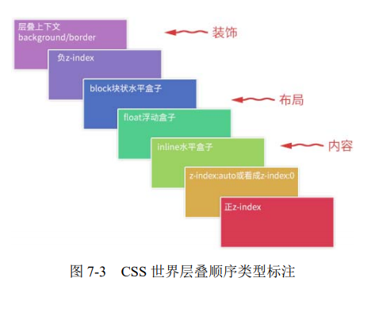

# css层叠

层叠的规则:
1. 谁大谁在上
2. 相同时，后来者居上

层叠上下文特性
1. 层叠上下文层叠水平 比 普通元素要高
2. 层叠上下文可以阻断元素的混合模式
3. 层叠上下文可以嵌套，内部的层叠上下文受制于外部的。
4. 每个层叠上下文里和兄弟元素是独立的；层叠变化或者渲染时，只需要考虑后代的元素
5. 每个层叠上下文时自成体系的，当元素发生层叠时，整个元素被人误在浮层；

层叠上下文的创建
分为三类，他们也是有一些特性的css属性创建的
1. 天生就是，比如页面的根元素，成为根层叠上下文。
2. 正统的，z-index值为数值的定位元素的传统 层叠上下文。这里的数值包含**0 正负数**
3. 扩展的 其他css3属性。

根层叠上下文：
  1. 可以理解为 <html>元素，因此页面里所有元素一定至少都在一个层叠结界中。
  2. 定位元素和传统层上下层叠文

